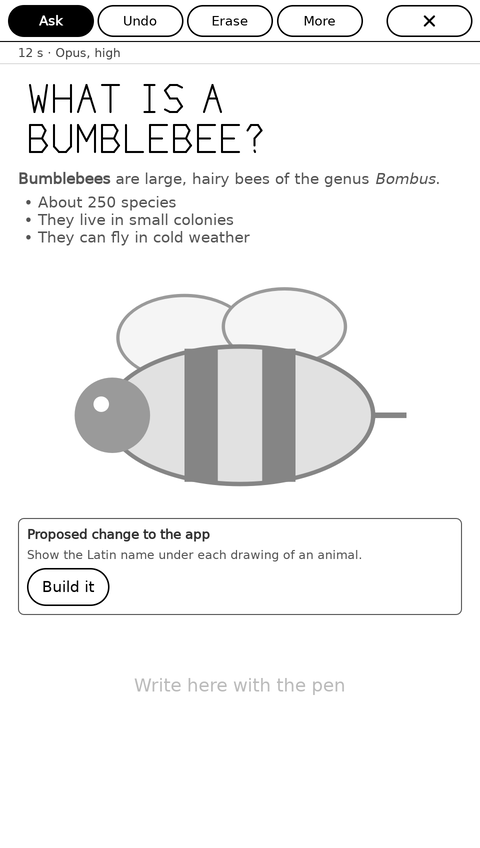
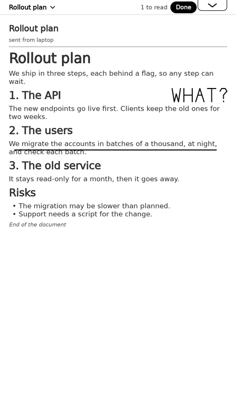
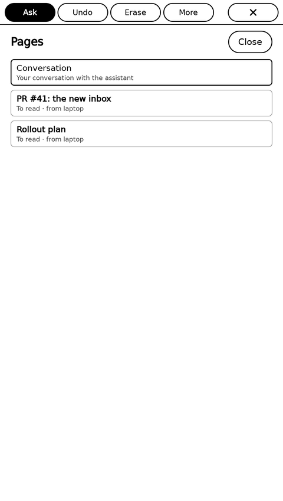
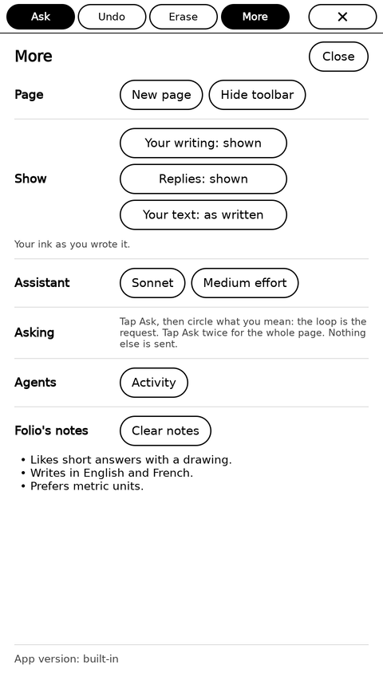
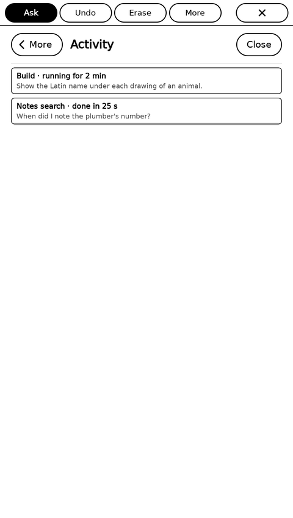
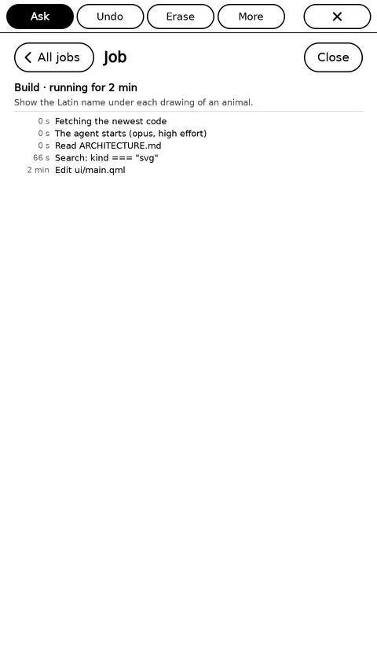

# Folio

An assistant for the reMarkable Paper Pro Move. Write with the pen, and the
model answers on the same page: typeset text, drawings, web pages. When you ask
for a change to the app itself, a builder agent makes a new version, tests it,
and Folio offers to install it.

Claude is the model today. The app speaks the Anthropic Messages API to a small
bridge that runs `claude -p`, so it runs on a Claude subscription and is not
tied to one model.

    tablet ── Folio app (QML in xochitl) ──► folio-bridge ──► claude -p
                                         └─► folio-server ──► the builder agent, versions, notes search

  
  
  

  
  
  

The page with a question, its answer and a change card; a reading sent from
the computer, marked with the pen; **Pages**; **More**; **Activity**; and a
build's log. `test/shots.sh` renders these offscreen, with sample content.

`ARCHITECTURE.md` is the full description: the parts, how an ask and a build
flow, trust, and the landmines. `CLAUDE.md` is how to work on the code; the
builder reads it too.

## What you need

- A reMarkable Paper Pro Move in developer mode, with
  [xovi](https://github.com/asivery/xovi), qt-resource-rebuilder and
  [AppLoad](https://github.com/asivery/rm-appload) (with its qtfb shim).
- The reMarkable SDK for the tablet's OS (for `build.sh`).
- A Linux host for the server and the bridge, with Claude Code logged in, and
  a way for the tablet to reach it (an SSH or WireGuard tunnel, or the local
  network). Give that host nothing else of yours: the builder has full tools
  there.
- Your own copy of this repo, and a deploy key with write access to it, for
  the builder's versions.

## Setup

**Server host.** With NixOS, import `nixosModules.default` from `flake.nix`:

    services.folio = {
      enable = true;
      builderRules = ./builder-rules.md;   # rules no commit can change; see ARCHITECTURE.md
      gitSshCommand = "ssh -i /var/lib/folio/.ssh/deploy -o IdentitiesOnly=yes";
    };

Then, as the `folio` user: log in with `claude`, clone your repo to
`/var/lib/folio/folio`, and put the deploy key in place. The bridge and the
server make their tokens on first start: `/var/lib/folio/bridge/token` and
`/var/lib/folio/server/token`. Without NixOS, run `folio-server` and
`folio-bridge` (see their `--help`) the same way:
`nix build .#folio-server .#folio-bridge`, or `go build` in `server/` and
`bridge/`.

**Tablet.** Build and install the app, then the tablet setup:

    FOLIO_TABLET=remarkable ./build.sh --install    # the app, into AppLoad
    scp -r tablet root@remarkable:/home/root/folio && ssh root@remarkable /home/root/folio/install.sh

and write `/home/root/.config/folio/folio.env`:

    ANTHROPIC_BASE_URL=http://127.0.0.1:18081   # the bridge, as the tablet reaches it
    ANTHROPIC_API_KEY=…                         # the bridge's token
    FOLIO_SERVER_URL=http://127.0.0.1:18082     # the server (this is the default)
    FOLIO_SERVER_TOKEN=…                        # the server's token
    FOLIO_SEARCH_URL=…                          # optional: a search, SearXNG JSON or DuckDuckGo HTML, with {q}
    FOLIO_SCREENSHOT_URL=…                      # optional: a screenshot service, with {url}

Open Folio from the AppLoad list. `tablet/README.md` has xovi at boot and the
notes mirror.

The tokens check who calls; they do not encrypt. The page, your notebooks and
the tokens travel as plain HTTP, so outside a trusted network, put the two
services behind a tunnel (SSH, WireGuard) or TLS.

## Using it

- The page is paper: write and draw, and nothing is sent until you ask.
- To ask, tap **Ask**, then draw a loop round what you mean: your question, or a
  question and what it is about. It is sent when the loop closes, and the
  answer goes below the loop. A loop with no question asks about what it holds.
- Tap **Ask** twice to ask about the whole page. A finger tap, Erase or Undo
  cancels.
- Your writing stays ink. **More › Show › Your text** shows what the agent read
  as type, and a tap on a word corrects it.
- Ask for a web page, a search or the weather; the page shows on the paper.
- **Read away from the computer:** `folio send spec.md` (Markdown, text, code,
  a diff, a PDF, a picture, a URL, or `-` for stdin) puts it on the tablet. The
  title row says "1 to read"; a tap on it opens **Pages**. On a reading page
  the toolbar is hidden, a finger tap at the top or bottom edge turns a screen,
  and nothing is sent while you mark and write. Tap **Done** in the title row:
  the agent writes a digest of your notes, which shows on the page and waits
  for you at the computer: `folio notes`, or `folio send --wait` in the session
  that sent it. For Claude Code, `skills/folio/` is a skill that knows these
  commands.
- Ask Folio to change itself. It writes a change card; tap **Build it**, follow
  it in **More › Activity**, then tap **Install**.
- **More** also has the model and effort, Folio's notes (its memory), and the
  app version.

## Development

    test/run.sh        # the offscreen QtTest suite, and a compile check with the tablet's Qt
    test/shots.sh      # each screen as a PNG in test/shots/
    tools/build.sh     # rmin, fbgrab, evread for the tablet (--install copies them)
    tools/shot out.png # a screenshot of the tablet
    tools/rmin …       # on the tablet: tap, swipe, pen and eraser strokes
    tools/install-version vN
    folio send FILE    # nix build .#folio: send something to read; folio notes, folio list

`FOLIO_TABLET` names the tablet's SSH host (default `remarkable`), `FOLIO_SDK`
the SDK (default `~/remarkable/sdk`).

## Notes on xochitl

- xochitl renders Qt Quick in software (the i.MX93 has no GPU), so the pad is
  128 px Canvas tiles, and only the tiles a stroke touches repaint (about 6 ms
  a frame). It uses `DisplayMethodArea.UFast`, xochitl's pen mode.
- The pen reaches QML as a plain mouse, with no pressure and no eraser; the
  native backend (`backend/eraser.c`) reads the eraser end from the digitizer.
  Touch arrives as synthesized mouse events.
- Replies render through `ui/markdown.js`, not Qt's Markdown importer, which
  draws code at a tiny size and drops text around inline HTML.
- The tablet's fonts lack most symbols: the app draws its icons.
